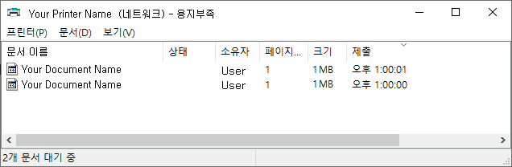

# PrintRefresh

## 문제설명

* 아무런 문제가 없지만 프린터의 기능오류가 발생한 경우, 이 방법으로 해결하는데에 도움이될 수 있습니다.
- 이 문제는 Microsoft Windows 환경에서 발생합니다.
- 이 문제는 네트워크 프린터에서 발생합니다.
- 이 문제는 이 프로그램을 실행해주는것으로 간단하게 해결됩니다.

아래 프로그램은 이 문서에서 설명한 내용과 완전히 동일합니다.  
[[프로그램 다운로드]](/PrintRefresh.exe)

## 원리설명

네트워크 윈도우에서 아무런 문제가 없고, 윈도우에만 문제가 있는 경우 아래와 같이 용지가 부족하다가 나타나는 경우가 있습니다.



당신의 프린터기기에 문제가 아무런 문제가 없으며, 윈도우 자체 문제로 의심할 수 있는 경우 아래 해결방법으로 해결할 수 있습니다.

1. 윈도우 단축키 `Widnows + R` 을 누릅니다.
2. `services.msc` 를 실행시킵니다.
3. 목록 중에서 `Print Spooler` 를 우클릭 합니다.
4. 우클릭 `중지(O)` 를 누릅니다.
5. 우클릭 `시작(S)` 를 누릅니다.

## 프로그램 설명
이와 같은 방법을 이 소스코드 프로그램을 실행시키는것으로 간단히 해결할 수 있습니다.


오픈소스 설명 | 사양
---------|----------
 플랫폼 | .NET을 지원하는 윈도우
 요구사항 | .NET Framework 4.5 이상이 설치된 컴퓨터
<br>

위 내용이 충족하지 않는 경우 아래의 소스를 컴퓨터 사양에 맞게 프레임 워크를 맞추어서 실행하면 됩니다.

```cs
using System;
using System.ServiceProcess;
using System.Windows.Forms;

namespace PrintRefresh
{
    class Program
    {
        static void Main(string[] args)
        {
            // Stop the spooler.
            ServiceController service = new ServiceController("Spooler");
            if ((!service.Status.Equals(ServiceControllerStatus.Stopped)) &&
                (!service.Status.Equals(ServiceControllerStatus.StopPending)))
            {
                service.Stop();
                service.WaitForStatus(ServiceControllerStatus.Stopped);
            }

            // Start the spooler.
            service.Start();
            service.WaitForStatus(ServiceControllerStatus.Running);

            MessageBox.Show("프린터 새로고침 완료.");
        }
    }
}

```

